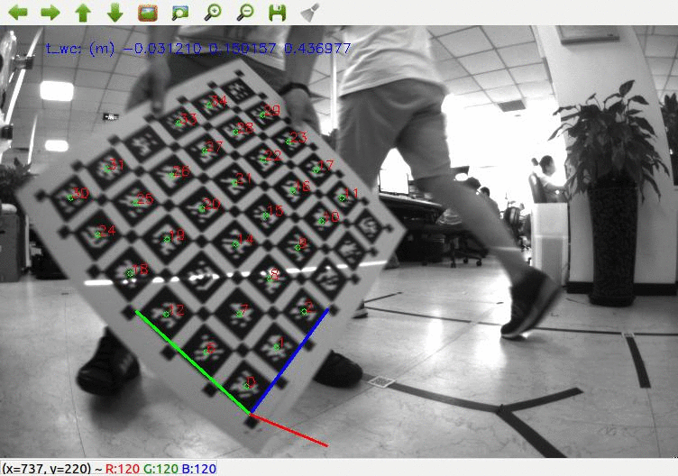

## Camera Laser Calibration Tool
[](README.md)

### 1. Introdution
This project is used to calibrating the extrinsic parameters $ T_ {cl} $ between a 2d laser and a monocular camera. As below figure show, The camera can estimate the plane equation of the calibration board in the camera coordinate system. Since the laser point cloud falls on the plane, the point cloud passes the laser coordinate system to the external parameter of the camera coordinate system $ T_ {cl} $ Converts to the camera coordinate system, we can use the point-to-plane distance as the cost function to estimating $ T_ {cl} $ by using nonlinear least-squares algorithm.


### 2. Feature
1. ** Support Multi-Apriltag**。 If you want high precision, we suggest you choose the Multi-Apriltag ( [kalibr_tag.pdf](doc/april_6x6_80x80cm_A0.pdf) ) as your calibration board. Otherwise, You can just print a apriltag with A4 paper ([apriltag.pdf](/doc/apriltags1-20.pdf)) and paste it onto a flat panel。The detail info about ( [kalibr_tag.pdf](doc/april_6x6_80x80cm_A0.pdf) ) please visit [kalibr website](https://github.com/ethz-asl/kalibr/wiki/calibration-targets).
2. **Support Multi Camera Model**。**radial-tangential (radtan)** : (*distortion_coeffs*: [k1 k2 r1 r2]); **equidistant (equi)**:*distortion_coeffs*: [k1 k2 k3 k4]). More info please visit [kalibr website](https://github.com/ethz-asl/kalibr/wiki/supported-models).
3. **Laser Segment auto-Detection**。The laser segment falling on the calibration plate is automatically extracted, provided that the calibration plate is within 120 degrees directly in front of the laser, and there is only one continuous straight line segment. So, please place the calibration board in an open space when you collect calibration data.

### 3. Download and build
```c++
mkdir LaserCameraCal_ws
mkdir ../src
cd src
git clone https://github.com/MegviiRobot/CamLaserCalibraTool
cd ..
catkin_make -DCMAKE_BUILD_TYPE=Release
```
### 4. Run

#### 4.1 Preparation
Please configure the config/calibra_config.yaml file with **the camera model parameters, the name and save path of the rosbag package, the size and type of the calibration board**. Please refer to the corresponding config.yaml for details.

Collect laser data to make rosbag, please place the calibration plate on the laser and camera front 0.3m ~ 1.5m, fully move the calibration plate (each axis, each angle, each distance and height are fully moving)


#### 4.2 Run kalibr to detect apriltag and estimate the camera pose
The camera pose between the camera frame and tag frame will be saved as a txt file.
```c++
cd LaserCameraCal_ws
source devel/setup.bash
roslaunch lasercamcal_ros kalibra_apriltag.launch 
```
#### 4.3 Run the calibration code
```c++
roslaunch lasercamcal_ros calibra_offline.launch 
```
The automatic detection of the laser segment is shown below with <font color = red>the red points</font>：


#### 4.4 Validation Results
```c++
roslaunch lasercamcal_ros debug.launch 
rosbag play yourbagdata.bag
```


## 5. TODO

1. uhhh.....


## 6. Authors
1. Yijia He, you can find the chinese version [in his homepage](https://blog.csdn.net/heyijia0327/article/details/85000943), if you have any question, please contact heyijia at megvii dot com
2. XiZhen Xiao
3. Xiao Liu, [his homepage](http://www.liuxiao.org/)

## 7. Ref:
2004, Qilong Zhang, Extrinsic Calibration of a Camera and Laser Range Finder (improves camera calibration).
